# Image Enhancement

Base on multiple papers about image enhancement, I create this library as API to call them easily. Image enhancement makes color of images more equalization by automatic or parameters. 

  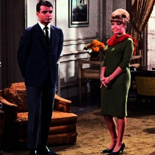  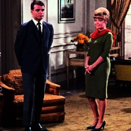 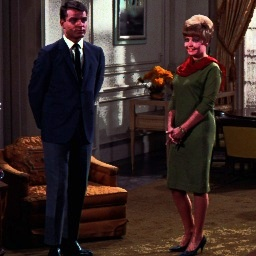 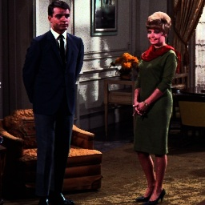 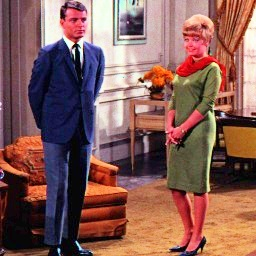 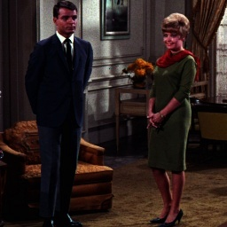 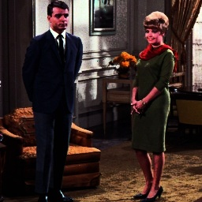 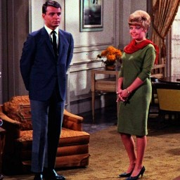 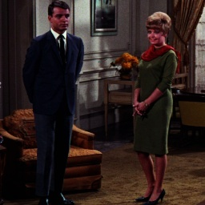 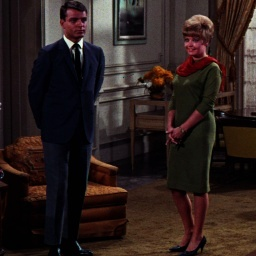  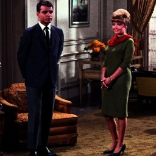 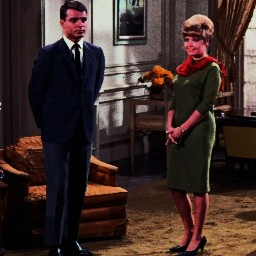 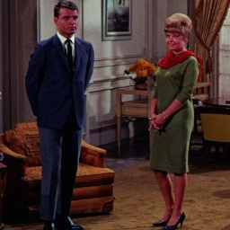  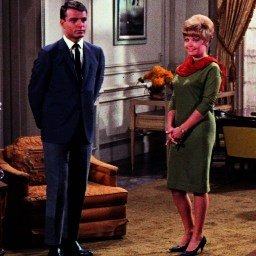 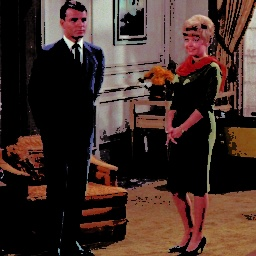

(a) **Origin**, (b) **GHE**, (c) **BBHE**, (d) **QBHE**, (e) **DSIHE**, (f) **MMBEBHE**, (g) **RMSHE**, (h) **BUBOHE**, (i) **BPHEME**, (j) **RSIHE**, (k) **WTHE**, (l) **RSWHE-D**, (m) **RSWHE-M**, (n) **FHSABP**, (o) **BHEPL**, (p) **RLBHE**, (q) **DCRGC**, (r) **AGCWD**, (s) **AGCCPF**, (t) **FLH**

## Installation

```bash
pip install image-enhancement
```

## Usage

```python
from image_enhancement import image_enhancement
import cv2 as cv

input = cv.imread('input.jpg')

ie = image_enhancement.IE(input, 'HSV')
output = ci.GHE()
```

## IE (Image Enhancement)

Entry point to call image enhancement functions. Currently, there are three main groups, histogram equalization, gamma correction and other.

```python
from image_enhancement import image_enhancement

ie = image_enhancement.IE(image, color_space = 'HSV')
```

### Histogram Equalization

#### GHE (Global Histogram Equalization)

This function is similar to ```equalizeHist(image)``` in opencv.

```python
ie.GHE()
```

#### BBHE (Brightness Preserving Histogram Equalization)

Kim, Yeong-Taeg.

Contrast enhancement using brightness preserving bi-histogram equalization.

IEEE transactions on Consumer Electronics 43, no. 1 (1997): 1-8.

```python
ie.BBHE()
```

#### QBHE (Quantized Bi-Histogram Equalization)

Kim, Yeong-Taeg. 

Quantized bi-histogram equalization.

In 1997 IEEE International Conference on Acoustics, Speech, and Signal Processing, vol. 4, pp. 2797-2800. IEEE, 1997.

```python
ie.QBHE(number_gray)
```

#### DSIHE (Dualistic Sub-Image Histogram Equalization)

Wang, Yu, Qian Chen, and Baeomin Zhang.

Image enhancement based on equal area dualistic sub-image histogram equalization method.

IEEE Transactions on Consumer Electronics 45, no. 1 (1999): 68-75.

```python
ie.DSIHE()
```

#### MMBEBHE (Minimum Mean Brightness Error Histogram Equalization)

Chen, Soong-Der, and Abd Rahman Ramli.

Minimum mean brightness error bi-histogram equalization in contrast enhancement.

IEEE transactions on Consumer Electronics 49, no. 4 (2003): 1310-1319.

```python
ie.MMBEBHE()
```

#### RMSHE (Recursively Mean-Separate Histogram Equalization)

Chen, Soong-Der, and Abd Rahman Ramli.

Contrast enhancement using recursive mean-separate histogram equalization for scalable brightness preservation.

IEEE Transactions on consumer Electronics 49, no. 4 (2003): 1301-1309.

```python
ie.RMSHE(recursive)
```

#### BUBOHE (Bin Underflow and Bin Overflow Histogram Equalization)

Yang, Seungjoon, Jae Hwan Oh, and Yungfun Park.

Contrast enhancement using histogram equalization with bin underflow and bin overflow.

In Proceedings 2003 International Conference on Image Processing (Cat. No. 03CH37429), vol. 1, pp. I-881. IEEE, 2003.

```python
ie.BUBOHE(underflow, overflow)
```

#### BPHEME (Brightness Preserving Histogram Equalization with Maximum Entropy)

Wang, Chao, and Zhongfu Ye.

Brightness preserving histogram equalization with maximum entropy: a variational perspective.

IEEE Transactions on Consumer Electronics 51, no. 4 (2005): 1326-1334.

```python
ie.BPHEME()
```

#### RSIHE (Recursive Sub-Image Histogram Equalization)

Sim, K. S., C. P. Tso, and Y. Y. Tan.

Recursive sub-image histogram equalization applied to gray scale images.

Pattern Recognition Letters 28, no. 10 (2007): 1209-1221.

```python
ie.RSIHE(recursive)
```

#### WTHE (Weighted Thresholded Histogram Equalization)

Wang, Qing, and Rabab K. Ward.

Fast image/video contrast enhancement based on weighted thresholded histogram equalization.

IEEE transactions on Consumer Electronics 53, no. 2 (2007): 757-764.

```python
ie.WTHE(root, value, lower)
```

#### RSWHE (Recursive Separated and Weighted Histogram Equalization)

Kim, Mary, and Min Gyo Chung.

Recursively separated and weighted histogram equalization for brightness preservation and contrast enhancement.

IEEE Transactions on Consumer Electronics 54, no. 3 (2008): 1389-1397.

```python
ie.RSWHE(type, beta, recursive)
```

#### FHSABP (Flattest Histogram Specification with Accurate Brightness Preservation)

Wang, C., J. Peng, and Z. Ye.

Flattest histogram specification with accurate brightness preservation.

IET Image Processing 2, no. 5 (2008): 249-262.

```python
ie.FHSABP()
```

#### BHEPL (Bi-Histogram Equalization with a Plateau Limit)

Ooi, Chen Hee, Nicholas Sia Pik Kong, and Haidi Ibrahim.

Bi-histogram equalization with a plateau limit for digital image enhancement.

IEEE transactions on consumer electronics 55, no. 4 (2009): 2072-2080.

```python
ie.BHEPL()
```

#### RLBHE (Range Limited Bi-Histogram Equalization)

Zuo, Chao, Qian Chen, and Xiubao Sui.

Range limited bi-histogram equalization for image contrast enhancement.

Optik 124, no. 5 (2013): 425-431.

```python
ie.RLBHE()
```

### Gamma Correction

#### DCRGC (Dynamic Contrast Ratio Gamma Correction)

Wang, Zhi-Guo, Zhi-Hu Liang, and Chun-Liang Liu.

A real-time image processor with combining dynamic contrast ratio enhancement and inverse gamma correction for PDP.

Displays 30, no. 3 (2009): 133-139.

```python
ie.DCRGC(contrast_intensity, gamma)
```

#### AGCWD (Adaptive Gamma Correction with Weighting Distribution)

Huang, Shih-Chia, Fan-Chieh Cheng, and Yi-Sheng Chiu.

Efficient contrast enhancement using adaptive gamma correction with weighting distribution.

IEEE transactions on image processing 22, no. 3 (2012): 1032-1041.

```python
ie.AGCWD(alpha)
```

#### AGCCPF (Adaptive Gamma Correction Color Preserving Framework)

Gupta, Bhupendra, and Mayank Tiwari.

Minimum mean brightness error contrast enhancement of color images using adaptive gamma correction with color preserving framework.

Optik 127, no. 4 (2016): 1671-1676.

```python
ie.AGCCPF(alpha)
```

### Other

#### FLH (Fuzzy-Logic and Histogram)

Raju, G., and Madhu S. Nair.

A fast and efficient color image enhancement method based on fuzzy-logic and histogram.

AEU-International Journal of electronics and communications 68, no. 3 (2014): 237-243.

```python
ie.FLH(enhancement)
```

## Quantitation

Entry point to call quantitation functions.

```python
from contrast_image import quantitation

quantitation = Quantitation()
```

#### AMBE (Absolute Mean Brightness Error)

```python
quantitatin.AMBE(input_image, output_image)
```

#### PSNR (Peak Signal to Noise Ratio)

```python
quantitatin.PSNR(input_image, output_image)
```

#### Entropy

```python
quantitatin.Entropy(image)
```

## Contributing

Pull requests are welcome. For major changes, please open an issue first to discuss what you would like to change.

Please make sure to update tests as appropriate.

## License

[MIT](https://choosealicense.com/licenses/mit/)